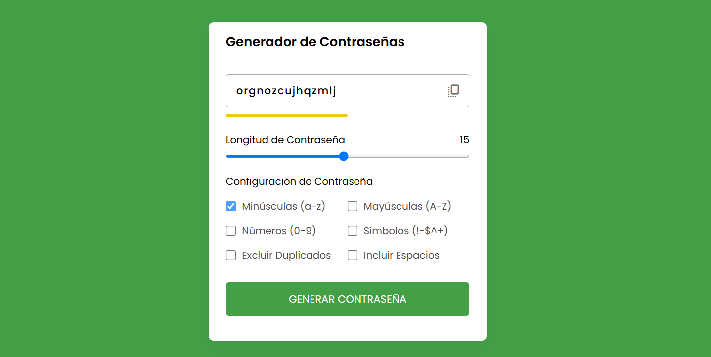

# 🔐 Generador de Contraseñas 

Un generador de contraseñas seguras y personalizables. Este es el proyecto #3 de mi desafío personal de [100 días de JavaScript](https://github.com/gianmattus-programmer/100-DIAS-DE-JS).

✨ Características

- 🎯 Genera contraseñas de longitud personalizable
- 🔠 Incluye mayúsculas y minúsculas
- 🔢 Números aleatorios
- #️⃣ Símbolos especiales
- 📋 Copiar al portapapeles con un click
- 🎲 Generación instantánea de nuevas contraseñas

## 🚀 Demo en vivo

[¡Prueba el generador aquí!](https://pass-generator-gianmattus-programmers-projects.vercel.app/) 

## 💻 Guía rápida de uso

<table>
<tr>
<td>

### 🎯 Configuración
1. Selecciona la longitud deseada
2. Marca las opciones que necesites
3. Click en "Generar contraseña"

</td>
<td>

### 🔑 Obtener contraseña
1. La contraseña se genera automáticamente
2. Click en el botón de copiar
3. ¡Listo para usar!

</td>
</tr>
</table>

## ⚡ Opciones disponibles

| Opción | Función |
|-------|---------|
| `Mayúsculas` | Incluir letras mayúsculas (A-Z) |
| `Minúsculas` | Incluir letras minúsculas (a-z) |
| `Números` | Incluir dígitos (0-9) |
| `Símbolos` | Incluir caracteres especiales (!@#$%^&*) |

## 🌟 Autor

**[@Gianmattus-Programmer](https://github.com/Gianmattus-Programmer)** 

---

⌨️ con ❤️ por [Gianmattus-Programmer] | 🌟 ¡Dale una estrella si te gustó! 🌟

